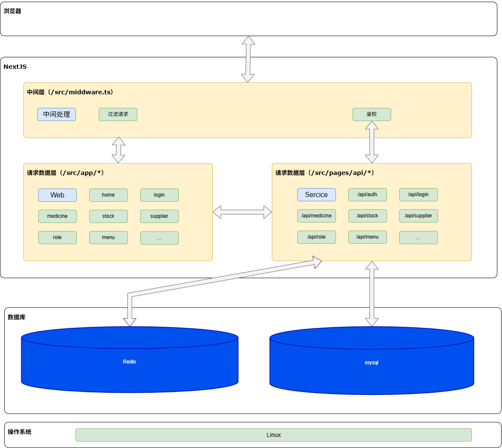

# 药品管理系统

## 项目简介

基于 Next.js 14 构建的现代药品管理系统，集成以下核心功能：

- 🧑⚕️ 药品全生命周期管理（CRUD）
- 📦 实时库存追踪与预警
- 🔐 JWT 鉴权与 RBAC 权限体系
- 📊 操作日志审计追踪
- 🔔 系统通知管理
- 🌓 主题切换功能

**技术栈**：  
Next.js 14 | TypeScript 5 | Redux Toolkit | Semi Design | MySQL | Redis | Axios | 

## 功能亮点

### 系统架构



### 核心模块

| 模块    | 技术实现                      | 关键特性             |
|-------|---------------------------|------------------|
| 认证授权  | JWT + Redis 会话管理          | 双Token自动刷新机制     |
| 权限管理  | RBAC 模型                   | 动态路由权限校验         |
| 数据持久化 | MySQL 关系型存储               | Sequelize ORM 管理 |
| 缓存加速  | Redis 热点数据缓存              | 自动缓存失效策略         |
| 状态管理  | Redux Toolkit + RTK Query | 自动生成API客户端       |
| UI组件库 | Semi Design 企业级组件库        | 深色/浅色主题适配        |

## 项目结构
```plaintext
.
├── src
│ ├── app/ # App Router 路由
│ ├── components/ # 可复用组件
│ │ ├── Page/ # 页面级组件
│ │ └── layout/ # 全局布局组件
│ ├── db/ # 数据库配置
│ ├── pages/api/ # API 路由
│ │ ├── auth/ # 认证相关
│ │ ├── medicine/ # 药品管理
│ │ └── stock/ # 库存管理
│ ├── reducer/ # Redux切片
│ ├── tools/ # 工具类
│ │ ├── axios/ # 封装请求实例
│ │ ├── jwt/ # Token处理
│ │ └── redis/ # 缓存管理
└───└── middleware.ts # 全局中间件
```

## 快速开始

### 环境准备

1. 安装依赖

   ```bash
      npm install
   ```

2. 配置数据库
   使用  MySQL 创建数据库 `medicine` （导入 `medicine.sql` 创建表）

3. 配置环境变量
   cp .env.example .env.local
   `.env.local` 配置示例：
```ini
# node env
NODE_ENV=development

# mysql
MYSQL_HOST=localhost
MYSQL_PORT=3306
MYSQL_USER=root
MYSQL_PASSWORD=123456
MYSQL_DATABASE=medicine

# redis
REDIS_HOST=localhost
REDIS_PORT=6379
REDIS_PASSWORD=123456
REDIS_DB=2
REDIS_CONNECT_TIMEOUT=5000

# minio
MINIO_ENDPOINT=localhost
MINIO_PORT=9008
MINIO_USE_SSL=false
MINIO_ACCESS_KEY=username
MINIO_SECRET_KEY=123456
MINIO_REGION=cn-west-rack-1

# jwt
JWT_SECRET_KEY=123456

# Cookies
# 访问令牌过期时间, 单位为秒, 这里设置为1h
EXPIRATION_TIME_ACCESS_TOKEN=3600
# 刷新令牌过期时间, 单位为秒, 这里设置为7天
EXPIRATION_TIME_REFRESH_TOKEN=604800

# URL
BASE_URL=http://localhost:3000
```

### 开发运行

```bash
npm run dev
```

### 生产构建

```bash
npm run build && npm start
```

